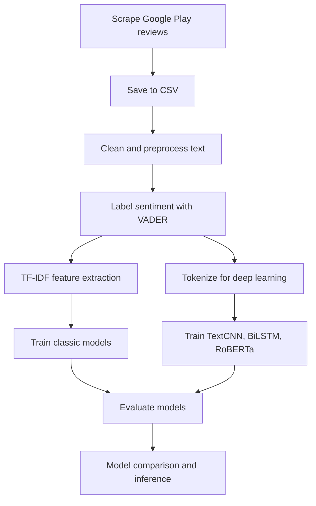

# Sentiment Analysis of Reverse: 1999 Game Reviews


This project performs sentiment analysis on **Reverse: 1999** game user reviews from Google Play Store. Review data collected using `google-play-scraper`, processed with NLP techniques, then evaluated using several machine learning and deep learning approaches to compare sentiment classification performance.

This project created as portfolio to demonstrate end-to-end workflow in text mining: **data scraping → preprocessing → sentiment labeling → feature extraction → model training → evaluation → inference**.

## Project Summary

- **Analysis target:** Reverse: 1999 application reviews (`com.bluepoch.m.en.reverse1999`)
- **Data source:** Google Play Store
- **Raw data count:** 14,168 reviews
- **Clean data on baseline notebook:** 13,106 reviews
- **Review language:** English (`lang='en'`, `country='us'`)
- **Task:** user review sentiment classification
- **Labeling:** weak labeling using VADER Sentiment Analyzer
- **Models compared:**
  - Naive Bayes
  - Logistic Regression
  - Random Forest
  - Decision Tree
  - RoBERTa fine-tuned
  - TextCNN
  - BiLSTM + GloVe + Attention
  - Ensemble voting on deep learning notebook

## Dataset

Main dataset stored in file:

```text
ulasan_aplikasi.csv
```

Scraped dataset columns:

| Column | Description |
| --- | --- |
| `reviewId` | Unique review ID |
| `userName` | Google Play user name |
| `userImage` | User profile photo URL |
| `content` | User review content |
| `score` | Star rating 1–5 |
| `thumbsUpCount` | Number of likes on review |
| `reviewCreatedVersion` | App version when review created |
| `at` | Review date |
| `replyContent` | Developer reply if available |
| `repliedAt` | Developer reply date |
| `appVersion` | App version |

Rating distribution in dataset:

| Rating | Review Count |
| --- | ---: |
| 1 | 976 |
| 2 | 415 |
| 3 | 579 |
| 4 | 1.334 |
| 5 | 10.864 |

> Note: Dataset contains public information from Google Play. For further use, avoid displaying personal user information like `userName` and `userImage` in public reports.

## Methodology

### 1. Data Scraping

File `scraping.py` retrieves reviews from Google Play Store using `google-play-scraper` package.

Main configuration:

```python
APP_ID = 'com.bluepoch.m.en.reverse1999'
TARGET_COUNT = 20000
BATCH_SIZE = 500
OUTPUT_FILE = 'ulasan_aplikasi.csv'
```

Scraping done in stages using continuation token until reaching target data or reviews no longer available.

### 2. Text Preprocessing

Preprocessing stages used in notebook include:

- Remove mentions, hashtags, retweet markers, URLs, numbers, and punctuation
- Case folding
- Tokenization
- Stopword removal
- Rejoin tokens back to clean text
- Remove empty and duplicate data

### 3. Sentiment Labeling

Sentiment labels created using **VADER Sentiment Analyzer** from NLTK.

On baseline notebook, sentiment classified into two classes:

- `positive`
- `negative`

On deep learning notebook, labels developed into three classes:

- `negative`
- `neutral`
- `positive`

Label mapping on deep learning notebook:

```python
LABEL_MAP = {
    'negative': 0,
    'neutral': 1,
    'positive': 2
}
```

### 4. Modeling

This project has two main notebooks:

| Notebook | Focus |
| --- | --- |
| `model_training.ipynb` | Baseline machine learning and RoBERTa fine-tuning for sentiment classification |
| `DL_model_training.ipynb` | Advanced deep learning experiments lanjutan menggunakan TextCNN, BiLSTM + GloVe + Attention, RoBERTa, and ensemble voting |

#### Baseline Machine Learning

Baseline approach uses features **TF-IDF** dan beberapa model klasik:

- Naive Bayes
- Logistic Regression
- Random Forest
- Decision Tree

#### Deep Learning

Notebook `DL_model_training.ipynb` contains eksperimen lanjutan:

- **TextCNN** with trainable embeddings, text augmentation, label smoothing, early stopping, and learning rate scheduler
- **BiLSTM + GloVe + Self-Attention** to capture token sequence context
- **RoBERTa fine-tuning** using model `cardiffnlp/twitter-roberta-base-sentiment-latest`
- **Majority Voting Ensemble** from TextCNN, BiLSTM, and RoBERTa

## Evaluation Results

Following results taken from output saved in `model_training.ipynb`.

| Model | Accuracy |
| --- | ---: |
| RoBERTa Fine-Tuned | 0.9554 |
| Random Forest | 0.9416 |
| Logistic Regression | 0.9378 |
| Decision Tree | 0.9100 |
| Naive Bayes | 0.8978 |

Best performing model on baseline notebook is **RoBERTa Fine-Tuned** with accuracy around **95.54%**.

## Project Structure

```text
Reverse 1999/
├── README.md
├── scraping.py
├── requirements.txt
├── ulasan_aplikasi.csv
├── model_training.ipynb
├── DL_model_training.ipynb
├── glove.twitter.27B.100d.txt
├── implementation_plan.md
└── .gitignore
```

Main file descriptions:

| File | Description |
| --- | --- |
| `scraping.py` | Script to retrieve Reverse: 1999 reviews from Google Play Store |
| `ulasan_aplikasi.csv` | Dataset of scraped reviews |
| `model_training.ipynb` | Baseline notebook: preprocessing, labeling, TF-IDF, classic models, RoBERTa, evaluation, and inference |
| `DL_model_training.ipynb` | Advanced deep learning experiments and ensemble notebook |
| `glove.twitter.27B.100d.txt` | Pre-trained GloVe embedding embedding embedding embedding embedding untuk eksperimen BiLSTM |
| `requirements.txt` | List of Python dependencies |

> File `glove.twitter.27B.100d.txt` is large and already in `.gitignore`, so not recommended for public repository upload.

## Technologies Used

- Python
- Pandas
- NumPy
- NLTK
- Scikit-learn
- PyTorch
- Transformers by Hugging Face
- Google Play Scraper
- Matplotlib
- Seaborn
- Jupyter Notebook / Google Colab

## How to Run Project

### 1. Clone Repository

```bash
git clone <url-repository>
cd "Reverse 1999"
```

### 2. Create Virtual Environment

```bash
python -m venv .venv
```

Activate environment:

```bash
# Windows
.venv\Scripts\activate

# macOS / Linux
source .venv/bin/activate
```

### 3. Install Dependencies

```bash
pip install -r requirements.txt
```

### 4. Run Data Scraping

```bash
python scraping.py
```

Script will produce file:

```text
ulasan_aplikasi.csv
```

### 5. Run Training Notebook

Open one of the following notebooks using Jupyter Notebook, JupyterLab, VS Code, or Google Colab:

```text
model_training.ipynb
DL_model_training.ipynb
```

Recommendations:

- Use GPU to run deep learning models, especially RoBERTa.
- For `DL_model_training.ipynb`, ensure GloVe file available and `GLOVE_PATH` adjusted.
- If running on Google Colab, upload dataset and GloVe to Google Drive per paths in notebook.

## Project Workflow



## Brief Insights

Based on rating distribution, majority of Reverse: 1999 reviews have very positive tone with 5-star rating dominance. However, some low-rating reviews highlight issues like power creep, resources, and gameplay. Therefore, sentiment analysis helps summarize user perception more systematically than just looking at aggregate ratings.

## Future Developments

Some possible developments:

- Add manual annotation to validate VADER labels
- Use additional metrics like macro F1, precision, recall, and confusion matrix on all models
- Save best models in `.pkl` or `.pt` format
- Create sentiment visualization dashboard
- Create simple API for new review sentiment inference
- Add aspect analysis, e.g., story, gameplay, gacha, performance, monetization

## Author

This project developed as part of data science / machine learning portfolio for game app review sentiment analysis.
