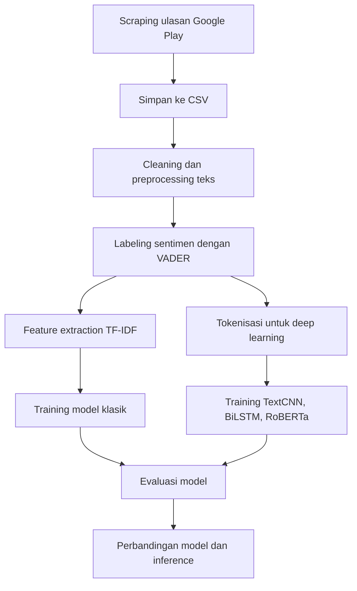

# Analisis Sentimen Ulasan Game Reverse: 1999


Project ini melakukan analisis sentimen terhadap ulasan pengguna game **Reverse: 1999** di Google Play Store. Data ulasan dikumpulkan menggunakan `google-play-scraper`, diproses dengan teknik NLP, kemudian dievaluasi menggunakan beberapa pendekatan machine learning dan deep learning untuk membandingkan performa klasifikasi sentimen.

Project ini dibuat sebagai portofolio untuk menunjukkan alur kerja end-to-end dalam text mining: **data scraping → preprocessing → labeling sentimen → feature extraction → training model → evaluasi → inference**.

## Ringkasan Project

- **Objek analisis:** ulasan aplikasi Reverse: 1999 (`com.bluepoch.m.en.reverse1999`)
- **Sumber data:** Google Play Store
- **Jumlah data mentah:** 14.168 ulasan
- **Jumlah data bersih pada notebook baseline:** 13.106 ulasan
- **Bahasa ulasan:** English (`lang='en'`, `country='us'`)
- **Task:** klasifikasi sentimen ulasan pengguna
- **Labeling:** weak labeling menggunakan VADER Sentiment Analyzer
- **Model yang dibandingkan:**
  - Naive Bayes
  - Logistic Regression
  - Random Forest
  - Decision Tree
  - RoBERTa fine-tuned
  - TextCNN
  - BiLSTM + GloVe + Attention
  - Ensemble voting pada notebook deep learning

## Dataset

Dataset utama tersimpan pada file:

```text
ulasan_aplikasi.csv
```

Kolom dataset hasil scraping:

| Kolom | Deskripsi |
| --- | --- |
| `reviewId` | ID unik ulasan |
| `userName` | Nama pengguna Google Play |
| `userImage` | URL foto profil pengguna |
| `content` | Isi ulasan pengguna |
| `score` | Rating bintang 1–5 |
| `thumbsUpCount` | Jumlah like pada ulasan |
| `reviewCreatedVersion` | Versi aplikasi saat ulasan dibuat |
| `at` | Tanggal ulasan |
| `replyContent` | Balasan developer jika tersedia |
| `repliedAt` | Tanggal balasan developer |
| `appVersion` | Versi aplikasi |

Distribusi rating pada dataset:

| Rating | Jumlah Ulasan |
| --- | ---: |
| 1 | 976 |
| 2 | 415 |
| 3 | 579 |
| 4 | 1.334 |
| 5 | 10.864 |

> Catatan: Dataset mengandung informasi publik dari Google Play. Untuk penggunaan lebih lanjut, sebaiknya hindari menampilkan informasi personal pengguna seperti `userName` dan `userImage` pada laporan publik.

## Metodologi

### 1. Data Scraping

File `scraping.py` mengambil ulasan dari Google Play Store menggunakan package `google-play-scraper`.

Konfigurasi utama:

```python
APP_ID = 'com.bluepoch.m.en.reverse1999'
TARGET_COUNT = 20000
BATCH_SIZE = 500
OUTPUT_FILE = 'ulasan_aplikasi.csv'
```

Scraping dilakukan bertahap menggunakan continuation token hingga mencapai target data atau sampai ulasan tidak tersedia lagi.

### 2. Text Preprocessing

Tahapan preprocessing yang digunakan pada notebook mencakup:

- Menghapus mention, hashtag, retweet marker, URL, angka, dan tanda baca
- Case folding
- Tokenisasi
- Stopword removal
- Menggabungkan kembali token menjadi teks bersih
- Menghapus data kosong dan duplikat

### 3. Sentiment Labeling

Label sentimen dibuat menggunakan **VADER Sentiment Analyzer** dari NLTK.

Pada notebook baseline, sentimen diklasifikasikan menjadi dua kelas:

- `positive`
- `negative`

Pada notebook deep learning, label dikembangkan menjadi tiga kelas:

- `negative`
- `neutral`
- `positive`

Mapping label pada notebook deep learning:

```python
LABEL_MAP = {
    'negative': 0,
    'neutral': 1,
    'positive': 2
}
```

### 4. Modeling

Project ini memiliki dua notebook utama:

| Notebook | Fokus |
| --- | --- |
| `model_training.ipynb` | Baseline machine learning dan fine-tuning RoBERTa untuk klasifikasi sentimen |
| `DL_model_training.ipynb` | Eksperimen deep learning lanjutan menggunakan TextCNN, BiLSTM + GloVe + Attention, RoBERTa, dan ensemble voting |

#### Baseline Machine Learning

Pendekatan baseline menggunakan fitur **TF-IDF** dan beberapa model klasik:

- Naive Bayes
- Logistic Regression
- Random Forest
- Decision Tree

#### Deep Learning

Notebook `DL_model_training.ipynb` berisi eksperimen lanjutan:

- **TextCNN** dengan trainable embedding, augmentasi teks, label smoothing, early stopping, dan learning rate scheduler
- **BiLSTM + GloVe + Self-Attention** untuk menangkap konteks urutan token
- **RoBERTa fine-tuning** menggunakan model `cardiffnlp/twitter-roberta-base-sentiment-latest`
- **Majority Voting Ensemble** dari TextCNN, BiLSTM, dan RoBERTa

## Hasil Evaluasi

Hasil berikut diambil dari output yang tersimpan pada `model_training.ipynb`.

| Model | Accuracy |
| --- | ---: |
| RoBERTa Fine-Tuned | 0.9554 |
| Random Forest | 0.9416 |
| Logistic Regression | 0.9378 |
| Decision Tree | 0.9100 |
| Naive Bayes | 0.8978 |

Model dengan performa terbaik pada notebook baseline adalah **RoBERTa Fine-Tuned** dengan akurasi sekitar **95,54%**.

## Struktur Project

```text
Reverse 1999/
├── README.md
├── scraping.py
├── requirements.txt
├── ulasan_aplikasi.csv
├── model_training.ipynb
├── DL_model_training.ipynb
├── glove.twitter.27B.100d.txt
├── implementation_plan.md
└── .gitignore
```

Keterangan file utama:

| File | Deskripsi |
| --- | --- |
| `scraping.py` | Script untuk mengambil ulasan Reverse: 1999 dari Google Play Store |
| `ulasan_aplikasi.csv` | Dataset ulasan hasil scraping |
| `model_training.ipynb` | Notebook baseline preprocessing, labeling, TF-IDF, model klasik, RoBERTa, evaluasi, dan inference |
| `DL_model_training.ipynb` | Notebook eksperimen deep learning lanjutan dan ensemble |
| `glove.twitter.27B.100d.txt` | Pre-trained GloVe embedding untuk eksperimen BiLSTM |
| `requirements.txt` | Daftar dependency Python |

> File `glove.twitter.27B.100d.txt` berukuran besar dan sudah dimasukkan ke `.gitignore`, sehingga tidak direkomendasikan untuk diunggah ke repository publik.

## Teknologi yang Digunakan

- Python
- Pandas
- NumPy
- NLTK
- Scikit-learn
- PyTorch
- Transformers by Hugging Face
- Google Play Scraper
- Matplotlib
- Seaborn
- Jupyter Notebook / Google Colab

## Cara Menjalankan Project

### 1. Clone Repository

```bash
git clone <url-repository>
cd "Reverse 1999"
```

### 2. Buat Virtual Environment

```bash
python -m venv .venv
```

Aktivasi environment:

```bash
# Windows
.venv\Scripts\activate

# macOS / Linux
source .venv/bin/activate
```

### 3. Install Dependency

```bash
pip install -r requirements.txt
```

### 4. Jalankan Scraping Data

```bash
python scraping.py
```

Script akan menghasilkan file:

```text
ulasan_aplikasi.csv
```

### 5. Jalankan Notebook Training

Buka salah satu notebook berikut menggunakan Jupyter Notebook, JupyterLab, VS Code, atau Google Colab:

```text
model_training.ipynb
DL_model_training.ipynb
```

Rekomendasi:

- Gunakan GPU untuk menjalankan model deep learning, terutama RoBERTa.
- Untuk `DL_model_training.ipynb`, pastikan file GloVe tersedia dan path `GLOVE_PATH` sudah disesuaikan.
- Jika menjalankan di Google Colab, upload dataset dan GloVe ke Google Drive sesuai path yang ada di notebook.

## Alur Kerja Project



## Insight Singkat

Berdasarkan distribusi rating, mayoritas ulasan Reverse: 1999 bernada sangat positif dengan dominasi rating 5. Namun, beberapa ulasan rating rendah menyoroti isu seperti power creep, resource, dan gameplay. Oleh karena itu, analisis sentimen membantu merangkum persepsi pengguna secara lebih sistematis daripada hanya melihat rating agregat.

## Pengembangan Selanjutnya

Beberapa pengembangan yang dapat dilakukan:

- Menambahkan anotasi manual untuk validasi label VADER
- Menggunakan metrik tambahan seperti macro F1, precision, recall, dan confusion matrix pada semua model
- Menyimpan model terbaik dalam format `.pkl` atau `.pt`
- Membuat dashboard visualisasi sentimen
- Membuat API sederhana untuk inference sentimen ulasan baru
- Menambahkan analisis aspek, misalnya story, gameplay, gacha, performance, dan monetization

## Author

Project ini dikembangkan sebagai bagian dari portofolio data science / machine learning untuk analisis sentimen ulasan aplikasi game.
